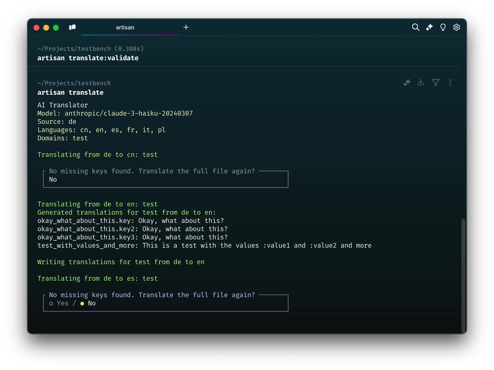

# Automatic AI Translations for Laravel 🤖

> Automatically translate your Laravel application's language files with high accuracy and context awareness using the power of LLMs. 
> 
> Translate to completely new languages or keep your existing language files up-to-date, without completely re-generating the full file. 
> 
> This package also includes tools for validation of the files, maintaining quality and consistency.



> [!NOTE]  
> `mateffy/ai-translations` is still pre-release software and currently in beta.
>
> You can already install and use the package, but only with `dev-main` versioning, as some stuff may still be subject to change.

## ✨ Features

- 🔄 Automatic translation of Laravel language files
- 🌐 Translate to new languages or update existing ones without full regeneration
- 🧠 Context-aware translations
- 🔍 Smart detection of missing translations
- 💬 Interactive chat mode for translation refinement
- ✅ Validation tools for quality assurance

<br>

## 🚀 Usage

### Step 1: Install the package

```bash
composer require mateffy/ai-translations
```

### Step 2: Configure your LLM provider

This package supports many different LLM providers using [`mateffy/llm-magic`](https://github.com/capevace/llm-magic).
To use this package, you will need to configure your LLM provider, preferably Anthropic or OpenAI.

To do this, add the following variables to your `.env` file.
For other LLM configurations see the [`llm-magic` documentation](https://github.com/capevace/llm-magic).

```env
AI_TRANSLATIONS_MODEL=anthropic/claude-3.5-sonnet # default
ANTHROPIC_API_KEY=your-api-key

# or if you are using OpenAI:

AI_TRANSLATIONS_MODEL=openai/gpt-4o
OPENAI_API_KEY=your-api-key
OPENAI_ORGANIZATION=your-organization # optional
```

### Step 3: Translate your files!

You are now good to go. Use the `translate` update or create a language file, and use the `translate:validate` command to check for missing translations.

```bash
$ php artisan translate

AI Translator
Model: anthropic/claude-3-haiku-20240307
Source: de
Languages: cn, en, es, fr, it, pl
Domains: test

Translating from de to en: test
Generated translations for test from de to en:
okay_what_about_this.key: Okay, what about this?
okay_what_about_this.key2: Okay, what about this?
okay_what_about_this.key3: Okay, what about this?
...
```

<br>

## 🛠️ Commands

### Translate Files

```bash
php artisan translate
```

This command translates your language files to all configured languages. It:
1. Detects missing translations
2. Uses AI to generate appropriate translations
3. Writes the translations to your language files

**Options:**
- `--dry-run` : Preview translations without saving
- `--name=<file>` : Translate a specific file only
- `--language=<code>` : Translate to a specific language only
- `--base-language=<code>` : Source language (defaults to `app.locale`)

<br>

### Validate Translations

```bash
php artisan translate:validate
```

Performs comprehensive validation of your translations by checking for missing keys.

**Options:**
- `--name=<file>` : Validate specific file
- `--language=<code>` : Validate specific language
- `--base-language=<code>` : Source language for validation

```bash
$ php artisan translate:validate

AI Translator: Validation
Model: anthropic/claude-3-haiku-20240307
Source: de
Languages: cn, en, es, fr, it, pl
Domains: test

Checking test in es...

No missing translations for test in es

Checking test in fr...

****************************************************
*     Missing translations for `test` in `fr`:     *
****************************************************

+---------------+-------------+
| Key           | Value       |
+---------------+-------------+
| something_new | Etwas neues |
| testing       | Testen      |
+---------------+-------------+
...
```

<br>

### Add New Language

```bash
php artisan translate:add {language}
```

Adds a new language to your application by:
1. Creating the language directory
2. Translating all existing files to the new language

**Options:**
- `--base-language=<code>` : Source language for translations

<br>

### Improve Translations

```bash
php artisan translate:improve {name} {language}
```

Opens an interactive chat session with the AI to refine translations for:
- Specific translation files
- Context-aware improvements
- Cultural nuances

**Options:**
- `--base-language=<code>` : Source language for comparison

<br>

## 🔧 How It Works

The TranslationFile class reads Laravel's PHP language files into memory, preserving their nested array structure while allowing access through dot notation (e.g., 'auth.failed' => 'message'). It handles both reading existing translations and creating new language files.

When translating, the system always provides the full source and target language files to the LLM to ensure it has complete context about the existing translations and their relationships. This helps maintain consistency in terminology and style across the application.

The LLM then returns only the translated strings that need to be added or updated, using dot notation. This selective return is efficient as it allows precise updates without regenerating the entire translation file. These dot-notated translations are automatically merged into the existing translation structure, handling both new keys and updates to existing ones.

<br>

## ⚙️ Configuration

Configuration options in `config/ai-translations.php`:

```php
return [
    // Supported languages (optional)
    'languages' => ['en', 'de', 'fr', 'es'],
    
    // Additional configuration options can be added here
];
```

<br>

## 🤝 Contributing

Contributions are welcome! Please feel free to submit pull requests.

<br>

## 📄 License

This package is open-source software licensed under the [MIT license](./LICENSE).
```
